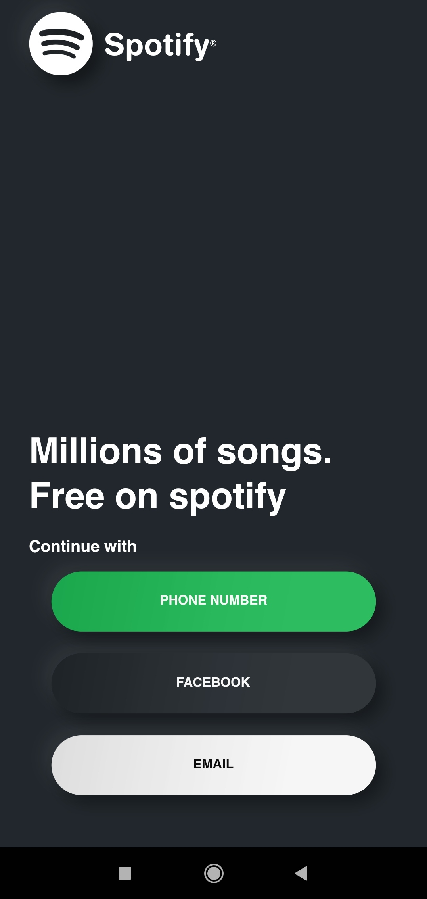
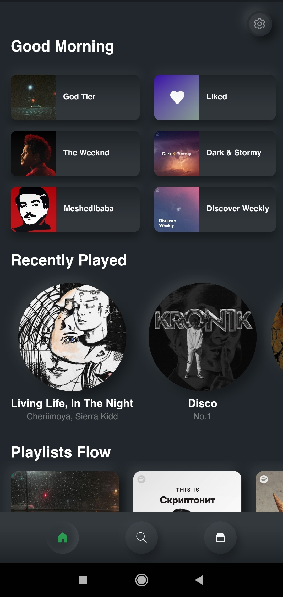
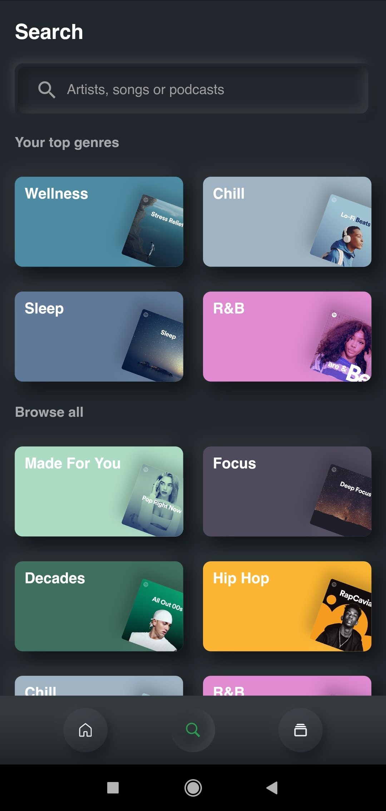
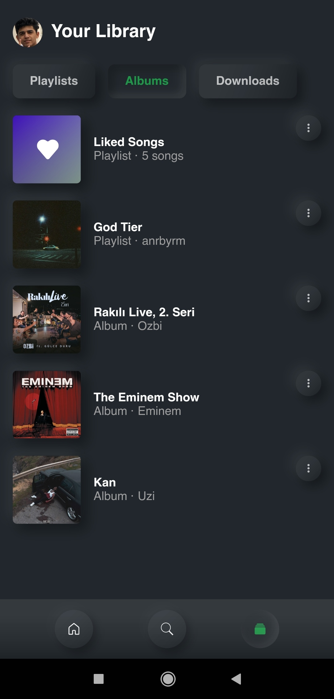

<!-- PROJECT SHIELDS -->
[![Forks][forks-shield]][forks-url]
[![Stargazers][stars-shield]][stars-url]
[![MIT License][license-shield]][license-url]

<!-- SPOTIFY LOGO -->
<br />
<p align="center">
  <a href="https://github.com/anrbyrm/neumorphicspotify">
    
  </a>

  <h3 align="center">Spotify Neumorphic Redesign</h3>
</p>

<!-- TABLE OF CONTENTS -->
<details open="open">
  <summary>Table of Contents</summary>
  <ol>
    <li><a href="#about-the-project">About The Project</a></li>
    <li><a href="#prerequisites">Prerequisites</a></li>
    <li><a href="#installation">Installation</a></li>
    <li><a href="#license">License</a></li>
    <li><a href="#contact">Contact</a></li>
    <li><a href="#used-dependencies-in-the-project">Used dependencies in the project</a></li>
  </ol>
</details>

<!-- ABOUT THE PROJECT -->
## About The Project

<a href="https://raw.githubusercontent.com/anrbyrm/neumorphicspotify/main/assets/images/login.jpg">
    
</a>
<a href="https://raw.githubusercontent.com/anrbyrm/neumorphicspotify/main/assets/images/menu_1.jpg">
    
</a>
<a href="https://raw.githubusercontent.com/anrbyrm/neumorphicspotify/main/assets/images/menu_2.jpg">
    
</a>
<a href="https://raw.githubusercontent.com/anrbyrm/neumorphicspotify/main/assets/images/menu_3.jpg">
    
</a>

This project created for learning purpose. As I finished some screens according Neumorphic design I wanted to share this project in Github.

U can navigate in README using table of contents.

## Prerequisites

For running this project in your machine, you need Flutter SDK installed on your computer.

For installing Flutter check out official documentation on Flutter.dev.
* [Flutter SDK](https://flutter.dev/docs/get-started/install)

<!-- Installation -->
### Installation

1. Clone the repo
   ```sh
   git clone https://github.com/anrbyrm/neumorphicspotify.git
   ```
2. Get dependencies
   ```sh
   flutter pub get
   ```
3. Run code on your device

<!-- LICENSE -->
## License

Distributed under the MIT License. See `LICENSE` for more information.

<!-- CONTACT -->
## Contact

[Facebook](https://www.facebook.com/anrbyrm)<br />
[Instagram](https://www.instagram.com/anrbyrm)

Project Link: [Neumorphic Spotify](https://github.com/anrbyrm/neumorphicspotify)

<!-- Used dependencies in project -->
## Used dependencies in the project
* [flutter_neumorphic](https://pub.dev/packages/flutter_neumorphic)
* [font_awesome_flutter](https://pub.dev/packages/font_awesome_flutter)
* [lint](https://pub.dev/packages/lint)
* [flutter_svg](https://pub.dev/packages/flutter_svg)
* [fluttertoast](https://pub.dev/packages/fluttertoast)

<!-- MARKDOWN LINKS & IMAGES -->
[forks-shield]: https://img.shields.io/github/forks/anrbyrm/neumorphicspotify?style=flat-square
[forks-url]: https://github.com/anrbyrm/neumorphicspotify/network
[stars-shield]: https://img.shields.io/github/stars/anrbyrm/neumorphicspotify?style=flat-square
[stars-url]: https://github.com/anrbyrm/neumorphicspotify/stargazers
[license-shield]: https://img.shields.io/github/license/anrbyrm/neumorphicspotify?style=flat-square
[license-url]: https://github.com/anrbyrm/neumorphicspotify/blob/main/LICENSE